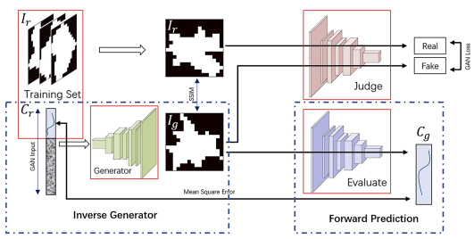

# MetaSurface

This is open source code for our metasurface machine learning series

1. [Metasurface Machine Learning performance Benchmark](https://aip.scitation.org/doi/10.1063/5.0061571)
2. SUTDPRT Dataset and Network Architect Search
3. Symmetry Inspired Metasurface Machine Learning

----
```
pip install tensorboardX
pip install scipy
pip install matplotlib
pip install optuna
pip install PyWavelets
pip install pandas
pip install tensorboard

git clone https://github.com/veya2ztn/mltool.git
git clone https://github.com/veya2ztn/SUTD_PRCM_dataset.git

echo "{\"DATAROOT\": \"[the path for your data]",\"SAVEROOT\": \"[the path for your checkpoint]"}" > .DATARoot.json
```

----

1. run `python makeproject.py` to generate task files under `projects/undo`

2. run `python multi_task_train.py` to start training.

   use `-m` or `--mode` assign train mode

   1. The `default` mode will train task in `projects/undo` one by one.
   2. The `test`  mode will run only 1 epoch and exit, meanwhile it will give the maximum batch size for current GPU. ( may fail after PyTorch 1.10)
   3. The `parallel` flag will active data parallel. Notice the official `torch.optim.Adam` optimizer is not compatible. Recommend use `torch.optim.SGD`.
   4. The `multiTask` flag should work with `--gpu NUM`. It will auto move task file to `project/muliti_set{gpu}` and run task on its individual GPU part.
   5. The `assign` flag should work with `--path` , which make script run assigned task.

   ```
   python makeproject.py
   python multi_task_train.py
   ```
------

#### Normal machine learning train

1. add model under `./model`
2. now model avaible:
   - Modified 2D Resnet18/34/50/101 with different tail layer
   - Modified Resnet18/34/50/101 Complex number version (Half/Full)
   - Modified Resnet+NLP
   - Modified DenseNet/SqueezeNet
   - 1D Resnet for directly inverse problem
   - Deep Multilayer Perceptron(MLP)
   - DARTS model (with geotype input)
3. Task-json-templete see `makeproject.py`
4. The front script is `train_base.py`


#### Network Architecture Search (DARTS-GAEA)

1. Task-json-templete see `makeNASproject.py`
2. The code is rewrite and unit weight now is split
   - call `architect_darts.ArchitectDARTS` for share weight evolution.
   - call `architect_msdarts.ArchitectMSDARTS` for full weight evolution. (which may allocate much more memory and may not stable [under my test] )
3. Notice the drop phase only work on train.
4. The front script is `darts_search.py`

#### Generative Adversarial Network

1. There are two way to train the GAN model

   - original  Deep Convolutional GAN (DCGAN) at `./GANproject/DCGAN*.py`
   - Wasserstein GAN (WGAN) at `./GANproject/GAN*.py` . However, Wasserstein distance in this scenario would make train unstable.

2. There are `DCGANTRAIN` and `DCGANCURVE` two part, link to `pattern confidence` and `pattern-curve map` accordingly.

3. The whole GAN flow for practice implement is

   
